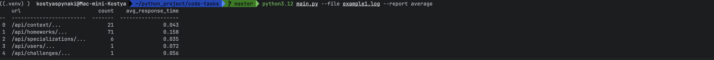
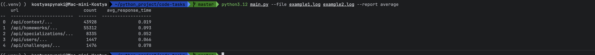
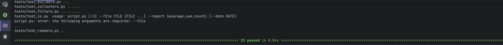

## Примеры работы

### Результат с одним файлом на входе

---

### Результат с несколькими файлами на входе

---

### Результат выполнения тестов

---

### Результат с фильтрами по дате

---

## Расширение функциональности

Для добавления новых видов отчетов воспользуйтесь классом `BaseCollector` в файле `collect.py`.  
Там же есть шаблон для реализации интерфейса `UserAgent`, если требуется поддержка различных источников данных.  
